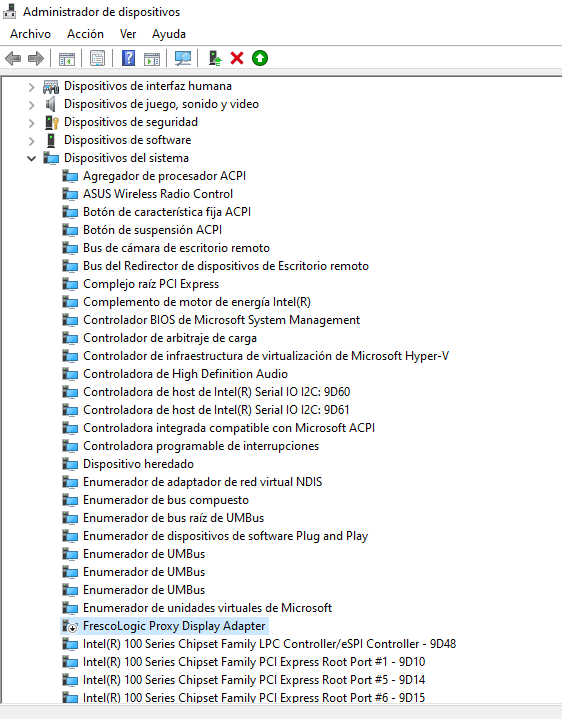

# Higurashi FAQ

Welcome to the Higurashi FAQ. You can find your question using the **instant search bar** at the top of the screen, or the **Table of Contents** on the right.

## What if my issue is not listed below?

Please proceed to the [Higurashi Support](support.md) page

## Common Questions

--8<-- "higurashi-voice-matching-level.md"

### What do the mod settings do?

If you're not sure what an option does, hover over the buttons in the mod menu. This will show a description of the option on the right hand side.

You can also see the [Shortcuts and Settings Page](Higurashi-Part-2---Patch-configuration-and-keyboard-shortcuts.md) for details on each keyboard shortcut and mod setting.

## Known Issues

### No Backgrounds, Sprites, or Images (just black screen with game text at bottom)

A black screen with text is sometimes part of normal gameplay (such as the start of Onikakushi Ch.1 after the opening poem). Please try playing for a while to see if the game really has a bug, or if the black screen with game text is on purpose.

If you find the problem continues (you can play the game, but no images are displayed), try closing the game and starting it again. After that, images should display properly.

### The game lags during voice playback

#### Possible Fixes

- If you're using Hamachi, disable it
- Disable any secondary network adapters
- Install the game on an SSD instead of a HDD

#### Reasoning for fixes

There is a known problem where having multiple network adapters can interfere with Unity's resource loading in the Higurashi games. See this issue for more details: [Unity may try to access the wrong network adapter](https://answers.unity.com/questions/623448/www-class-for-loading-local-texture-is-very-slow.html). It may also be possible other networking problems could cause lag.

As for the HDD issue - a fragmented or very full HDD may be slow to load the assets - hence we recommend installing on an SSD.

### Two of the same character's sprites appear on the screen (overlapping / duplicate sprite)

We haven't been able to 'properly' fix this bug yet, but you can apply this workaround:

- Save your game
- Restart the game
- Load your save

After applying this workaround, you may need to play the game a little before the sprite fully disappears.

We would be thankful if you could send us your saves when you have this issue so we can fix it.

### The game freezes on startup with a black or white screen

With the newest version of the mod, you shouldn't see the game freeze on a white or black screen on startup. If you encounter this issue:

1. Wait 1-2 minutes to see if it fixes itself. If not, continue to the next step.
2. Find the game log called  `output_log.txt` or `Player.log`, using the instructions at [Higurashi Support](support.md) (see "Getting Higurashi Game Log Files")
3. Submit the game log to us [on our Discord server](https://discord.gg/pf5VhF9) in the `#higu_support` channel, and hopefully we can figure out the problem

#### My game was working before, but now it's stuck on a black screen / Corrupted Save Issue

Sometimes save files can become corrupted. This causes the game to get stuck on a black screen, even though the game was working before. If this happens, you should see this somewhere around the top of the game log:

```
Could not read from save file C:\Users\drojf\AppData\Roaming\MangaGamer\higurashi02\save003.dat
Exception: System.IndexOutOfRangeException: Array index is out of range.
  at CLZF2.lzf_decompress (System.Byte[] input, System.Byte[]& output) [0x00000]in <filename unknown>:0
  at CLZF2.Decompress (System.Byte[] inputBytes) [0x00000] in <filename unknown>:0
  at Assets.Scripts.Core.Buriko.BurikoSaveManager.GetSaveData (Int32 slot, System.String path) [0x00000] in <filename unknown>:0
```

If this happens, **first disable Steam/GOG save sync**, then try deleting the exact save file mentioned in the game log (or moving it so the game can't find it).

For detailed instructions, see [Uninstalling your saves](Uninstall.md#uninstalling-your-saves).

#### Black screen randomly/after windows/graphics update with `IndexOutOfRangeException` in log

If you have a black screen, and also have a `IndexOutOfRangeException: Array index is out of range. at UnityEngine.Display.RecreateDisplayList (System.IntPtr[] nativeDisplay) [0x00000] in <filename unknown>:0`
in your game log, you probably have this problem.

This issue can affect all Unity games, not just Higurashi, and has to do with aspect ratio options in your graphics card control panel. See the second reply on [this steam forum post](https://steamcommunity.com/discussions/forum/1/1480982971174752598/) for details on how to fix this issue in Nvidia Control Panel (and also for Intel, AMD further in the thread).

### Save Compatibility / My saves don't work after updating

Saves between different releases of our mod are not compatible.

If you have made old saves, do not press 'continue' or load - please use the chapter jump menu or start a new game. You could get many kinds of weird behavior, for example being stuck on a black screen, or the game may crash.

If you want to use the saves on multiple machines (for example, using steam sync), make sure they are all running exactly the same version of the mod.

Global save data (like what you've unlocked so far) *should* be compatible between not only different releases of our mod, but also the unmodded game.

For details on save file locations, see "Save file locations" near the bottom of this page.

### There is no sound/audio/BGM/voices

When debugging this issue, it's worth testing and reporting these things

1. Check the in-game settings to see if the Voice, Music, or Sound Effects volume have been set to zero
2. Disable / Uninstall / Kill the proccesses associated with ANY "extra" audio related software or drivers installed on your computer!
    1. The following software (related to audio devices) may interfere with the voice/audio playback of the game, even if you're not using the device associated with them!
        - Razer Synapse
            - Specifically, the old version with the cloud icon. There may be multiple processes running, make sure to close them all/uninstall/disable all of them. Supposedly the new version does not cause   problems, but it's worth closing both
        - Logitech G Hub
        - Asus Sonic Studio 3
        - HyperX Software/Headsets
        - SteelSeries Nahimic (bundled with MSI computers!)
        - In general:
              - Gaming audio software
              - Bluetooth headset software
              - Any third-party software which is related to audio on your computer
    2. Please try disabling/uninstalling/killing the processes associated with the above software (check task manager to make sure the program(s) are completely closed!)
3. Try closing every program, and then using task manager to kill all processes on your computer (which Windows lets you kill). Then try running the game, to see if one of the processes was interfering.
4. Check if other chapters of the game have this issue, or it's just this chapter
5. Check if restarting your computer fixes the issue
6. Try another audio device (for example, your speakers instead of USB/Bluetooth headphones)
7. Check if you have the number sign (`#`), or any other strange special characters anywhere in your game path. This will cause you to only have sound during the opening video.

Try the above first, and if you still can't fix it, see the below for more help on specific cases:

#### No voices, but other sounds OK

Firstly, please make sure you have played past the opening section of the game. Narration is not voiced, so you have to wait until a character has spoken dialog before any voices will play ("They might talk like this!").

If voices are still not playing, press the **F10** button twice while not in a game menu to open the mod menu. Check if the BGM/voice volume is set to zero, and adjust it accordingly.

#### Only sound at Intro / Opening Video

1. This issue is mainly caused by other software or drivers interfering with the game.
    - The following is known to cause problems:
        - Razer Synapse
        - SteelSeries Nahimic
        - Probably all the software listed in the "There is no sound/audio/BGM/voices" list above

    - Please try uninstalling this software or killing the processes associated with these programs/drivers.

    - If you're not sure, try closing all programs, and also killing every process on your computer via task manager, then launch the game to see if that fixes the issue.

    - We had one user report this issue does not affect Chapters 1 and 2, but does affect Chapter 3.

    - If you have `Error: Cannot create FMOD::Sound instance for resource �t�, (Operation could not be performed because specified sound/DSP connection is not ready. )` on your game log, you probably have this issue.

2. We also had a user had the number sign (`#`) in their game path. This definitely causes all sound to stop working except for the opening movie. Make sure you don't have any special characters in your game path.

    - If you need to move or change your Steam game install location, follow the instructions here: [https://support.steampowered.com/kb_article.php?ref=7418-YUBN-8129](https://support.steampowered.com/kb_article.php?ref=7418-YUBN-8129)

3. We have also had the below reports, but they may be only coincidental:

    - One user fixed it by clearing the registry files for that chapter - but please only do this as a last resort. See "Registry file location and clearing" at the bottom of this page for how to do this.


#### No sound at all

Windows has a feature which lets you set volumes for individual apps, which could cause the game to be muted.

- Right click on the sound icon on the bottom right of your taskbar
- Click "Open Sound settings"
- Scroll down to "Advanced sound options"
- Click on "App volume and device preferences"
- Check if the game is muted (open the game now if it's not already open)

### Matsuribayashi Ch. 8 - Fatal error in gc: get thread context failed

If you get a `Fatal error in gc: get thread context failed` error, you may need to either uninstall your third-party (non-Windows/non-Microsoft) antivirus software, or unblock the game from your Antivirus Software.

AVG antivirus in particular is known to cause this issue.

### Text Log or other user interfaces (UI) stuck on screen

Even on the base game, it is sometimes possible to have various UI bugs, like pop-up menus or windows that you are unable to close.

In particular, the textlog can easily become struck on the screen because it is bound to the scroll wheel. If you scroll the wheel accidentally while clicking on a button, two popups can appear at the same time, confusing the game.

We don't have a fix for this at the moment, other than being careful not to activate your scroll wheel while navigating menus, and to navigate menus slowly (wait for the fade in/out to finish before clicking).

See [this github issue](https://github.com/07th-mod/higurashi-assembly/issues/60) for more details.

### Cannot save / Cannot click save button in Tips

Please check if you are playing a TIPS section of the game - [the game does not let you save/quicksave/load/quickload while you're in tips](https://github.com/07th-mod/tatarigoroshi/issues/74#issuecomment-578990330).

### Steam achievements don't unlock

Firstly, try restarting Steam, as it sometimes doesn't properly show achievements until restarted.

Previously, we have had other issues with achievements, so if you still can't get achievements to work, you can let us know.

### The game crashes on startup with a white screen. The crash log contains a "lci_proxyumd32.dll caused a Breakpoint" error

This error occurs if you are using a USB to HDMI adapter with a driver provided by Fresco Logic. See [this Hollow Knight thread for more details.](https://steamcommunity.com/app/367520/discussions/0/1700541698692038649/)

To fix this error, you need to disable (or uninstall?) the driver in Device Manager, at Device Manager > System Devices > FrescoLogic Proxy Display Adapter, as shown in the below screenshot:



## Known Issues - Manual Install

### The game crashes

Very often people download the newest voice patch and forget to update their graphics patch. When you leave the graphics patch outdated, the game will crash when the script tries to output a file that doesn't exist.
E.g.: the game tries to show you an image that doesn't exist in your ``CG`` folder.

We recommend using the installer's automatic update functionality to avoid this issue.

### The game is updated but some voices are not playing/some graphics are not showing!

When this happens, the very first thing you need to do is to clean your ``CompiledUpdateScripts`` folder. While in-game, press **F10**, then under "Save Files and Log Files" click "Show Compiled Scripts". Make sure your game is updated and the folder is empty, then run the game again. It should hang for a few seconds before playing the intro.
Always make sure to do these steps after updating your patch!

### Lag and Performance Issues

If the game lags or freezes every now and then, you may want to investigate these things:

- Close ALL programs running in the background, even ones which seem harmless.
- If your game is on a HDD (spinning disk drive), move it to an SSD (solid state disk). Also may be worth checking if your HDD is performing correctly - long file seek times may cause the game to freeze while assets load.
- Try to remember if there were any other changes to your computer recently (if the game was working correctly before). Things such as windows updates, driver updates, hardware changes, installed a new program, changed antivirus settings...
- If the game lags during voice playback, [see this known issue](FAQ.md#the-game-lags-during-voice-playback)
- Restart your computer
- While Higurashi isn't that demanding, very old computers/software may not be able to play with good performance. Please keep in mind that this is a Unity game, so some level of performance/modern hardware is required.

## Misc Questions

### Are there voices only patches (without the PS3 graphics)?

Yes, there are but they can be unofficial (Onikakushi), severely outdated (Watanagashi) and no longer supported (all chapters) so don't open any issues about voices only patches. Please understand that many features such as improved translation and PS3 exclusive lines are **not** available in these patches. The definitive version of the game is the voices and graphics patch. You can find the voice only patches on [this page](https://07th-mod.com/wiki/Higurashi/Higurashi-Part-1.1---Voices-only-Patch/).

### What is the “OST Remake” Option?

This OST remake effort was started before the April patch. It contains handmade remakes of several music tracks from the original release (pre-2019) - [Click here to listen to audio samples](https://radiataalice.bandcamp.com/album/hinamizawa-syndrome-vol-1)
This patch was created as more of a side-project to see how the midis in the original 1999 soundtrack could be improved upon with modern instruments, and also to fix clipping and distortion issues in the original Steam release.

## Save file locations

**NOTE:** If you want to clear or modify your save data, **make sure to disable Steam Cloud** as it will attempt to undo any changes you have made.

### Finding Saves Automatically

While in-game, press **F10**, then under "Save Files and Log Files" click "Show Saves".

### Finding Saves Manually

Please choose your OS below to find your saves:

=== "Windows"

    Saves are stored at:

    `C:\Users\[YOUR_USERNAME]\AppData\Roaming\MangaGamer\higurashi01`

    As a shortcut, paste this into the explorer address bar: `%AppData%/Mangagamer`

=== "Linux"

    - For Chapters 1-2, save data is split between two adjacent folders:
        - `~/.config/unity3d/MangaGamer/Higurashi When they Cry - Ch.1 Onikakushi`
        - `~/.config/unity3d/Mangagamer/Higurashi When They Cry _ Ch_1 Onikakushi`(note the underscores)
    - For Chapters 3-8, all save data is in one folder: `~/.config/unity3d/MangaGamer/Higurashi When they Cry - Ch.3 Tatarigoroshi`

=== "MacOS"

    Saves are stored at:

    `~/Library/Application Support/unity.MangaGamer.Higurashi When They Cry - Ch.1 Onikakushi/`

=== "Proton / Wine"

    When using Proton, saves are stored inside a Proton "prefix" (a `pfx` folder). Inside the prefix, they are stored at a similar location to Windows (it might use `Mangagamer` with a lowercase 'g')

    The full path to the folder is: `.steam/steam/steamapps/compatdata/[GAME_ID]/pfx/drive_c/users/steamuser/AppData/Roaming/Mangagamer/higurashi[CHAPTER_NUMBER]`.

    The `GAME_ID` can be found by going to the store page for the game, then looking at the URL for a 6 digit number - for example Higurashi Ch.1's ID is `310360`.

    So for Ch.1, the full path is: `.steam/steam/steamapps/compatdata/310360/pfx/drive_c/users/steamuser/AppData/Roaming/Mangagamer/higurashi01`.

In the folder you'll find:

- one `global.dat` which holds information not specific to a save file (note that some info is stored in the registry - see below)
- manual save files like `save000.dat`
- quicksaves like `qsave0.dat`
- the screenshots associated with each save file like `save000.png` and `qsave0.png`

To clear your save data, make a backup of these files, **disable Steam Cloud**, then delete all of them. **Steam will sync the saves in these folders**, so make sure to disable Steam Cloud temporarily if you want to clear out or modify your saves, otherwise they will just reappear/get overwritten by Steam.

The game also stores some additional settings related to resolution and fullscreen in the PlayerPrefs - see [Uninstalling Unity PlayerPrefs](Uninstall.md#uninstalling-unity-playerprefs) for more details.

## Player Preferences location and clearing

See [Uninstalling Unity PlayerPrefs](Uninstall.md#uninstalling-unity-playerprefs)

## I have questions about this Miotsukushi console arc

We have a separate [Miotsukushi FAQ page](MiotsukushiFAQ.md) to answer those

## I have questions about the April Update BGM/SE

We have a separate [BGM/SE FAQ page](BGM-SE-FAQ.md) to answer questions about the BGM / SE /  Higurashi Music and Sound Effects Changes.
