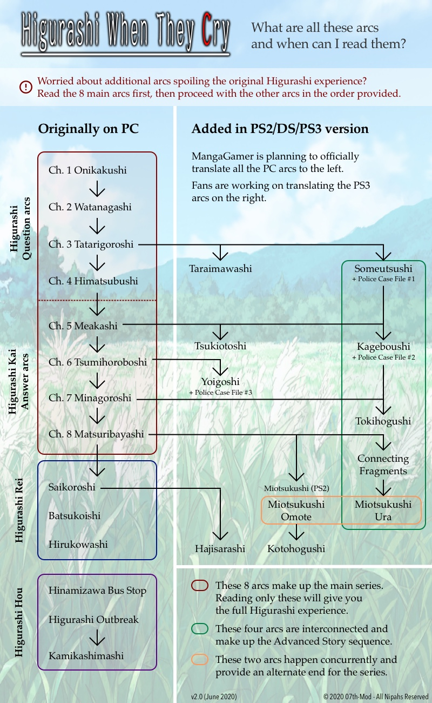

# Introduction

!!! info
    The links below will take you to the section **2a. Installer**. This is currently the best method to install the patch in any operating system.  
    However, if you prefer to install the patch manually, go to section **2b. Manual Installation** instead.

!!! warning "Careful about old save files!"
    Save files from older versions of the patch **or** the vanilla game are not expected to work properly with our patch. They might look fine sometimes, but you will hit a roadblock eventually. We recommend to start fresh from the beggining or use the "Chapter Select" function to start at the current chapter you were playing before. You can also hold ``ctrl`` to skip the game in high speed mode.

--8<-- "gnome-crash-warning.md"

## Main story arcs

There are two patch variants for the main story arcs:

- the "Full Patch": [**Click here to install and learn about the Full Patch**](Higurashi-Part-1---Voice-and-Graphics-Patch.md)
- the "Voices Only" patch, which we **do not offer support for**
    - When a new chapter comes out, we will do a quick voice-only patch for people to test and debug, followed by the full graphics path later. During this time period, we will offer support for the "beta-testing" Voices Only patch.
    - If you really wish to install the voices-only patch, [Click here](Higurashi-Part-1.1---Voices-only-Patch.md)

#### Patch Availability

| Chapter                | Full Patch Available                                              | Voices Only Available                                             |
| ---------------------- |:-------------------------------------------------------------- -: | :---------------------------------------------------------------:|
| Ch.1 - Onikakushi      | 
✔
 | 
✔
 |
| Ch.2 - Watanagashi     | 
✔
 | 
✔
 |
| Ch.3 - Tatarigoroshi   | 
✔
 | 
✔
 |
| Ch.4 - Himatsubushi    | 
✔
 | 
✔
 |
| Ch.5 - Meakashi        | 
✔
 | 
✔
 |
| Ch. 6 - Tsumihoroboshi | 
✔
 | 
✔
 |
| Ch. 7 - Minagoroshi    | 
✔
 | 
✔
 |

Community Forks: [Cnnctr's Ch.1 Voices Only Fork](https://github.com/Cnnctr/onikakushi)

## Console Arcs (extra chapters)

!!! warning "The console arcs requires Ch.4 Himatsubushi to be played"
    Installing it over your Himatsubushi installation will overwrite the game with the console arcs. We recommend to make a copy of the folder and install the console arcs there. **It is not required to install the Himatsubushi patch before installing the Console Arcs.**

Supported chapters:

* Someutsushi
* Kageboushi
* Tsukiotoshi
* Taraimawashi
* Tokihogushi
* Yoigoshi
* Miotsukushi Omote

**The console arcs should be played at the points of the story and in the order indicated by the below flowchart.**

[**Click here to install the patch**](Higurashi-Part-1---Voice-and-Graphics-Patch.md)
