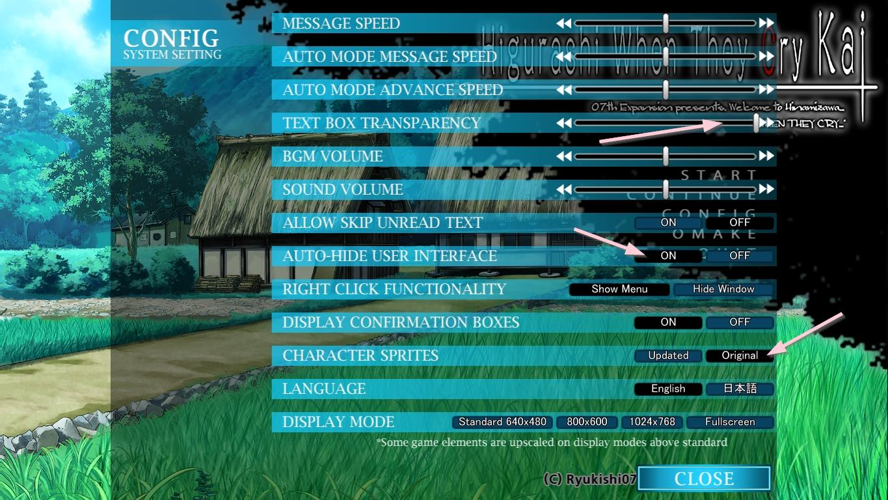
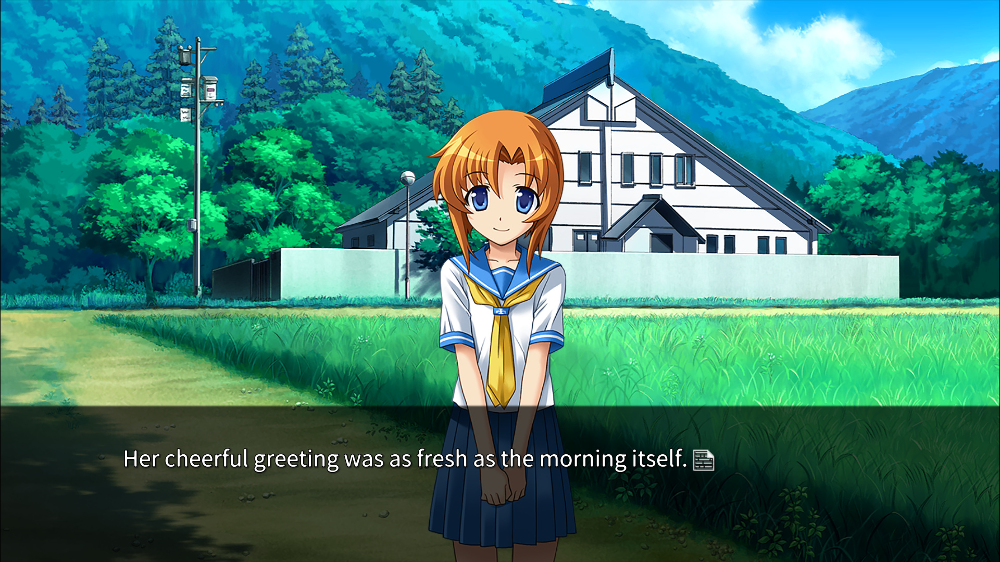

This section covers a few specific shortcuts we added to the game. These are only available in the full patch.

# Keyboard shortcuts

* **M** = Increase Voice Volume
* **N** = Decrease Voice Volume
* **Left Shift + M** = Voice Volume 100
* **Left Shift + N** = Voice Volume 0
***
* **7** = Enable/disable lipsync (only for PS3 sprites)
***
* **F1** = Toggle NVL/ADV mode
* **F2** = Change voice matching level (min 0, max 3)
    * Max = Full PS3 script fully voiced (might be censored at parts)
    * Min = Original PC script with voices where it fits (fully uncensored)
        * Default level (2) should be the most balanced option
* **F5** = Quick Save
* **F7** = Quick Load
***
* **F10** = Flag Monitor
    * Advanced tool to monitor your settings and for debug purposes
         * **Attention**: if you open the flag monitor in the main menu, it won't go away until you start the game and press F10 again!

# ADV Mode configuration 

The patch installation by default cannot change the game settings. To achieve the best results, open the game settings and configure it like the screenshot below:

* Text box transparency on far right (max)
* Auto-hide user interface: **ON**
* Character Sprites: **Original** (optional)

# Alternative clean ADV textbox

In case you find our official textbox distracting, we have an alternative kindly provided by @Ascoat.
[Click here](https://user-images.githubusercontent.com/20040718/31421264-ae4993b6-ae03-11e7-9eee-27422bc94a0e.png) and save the image as ``windo_filter_adv.png`` and put it inside the ``CG`` folder in ``StreamingAssets``. Overwrite the file and you should see the change next time you open the game.

