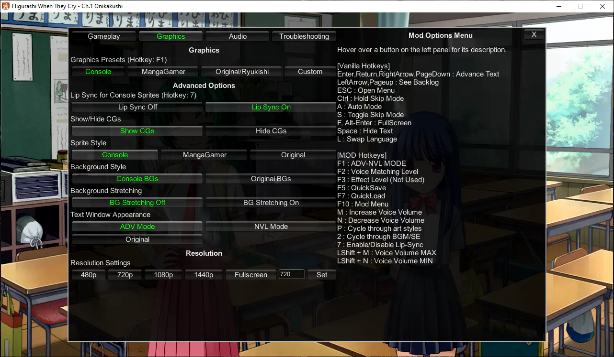

# Keyboard Shortcuts and Settings

## Mod Options Menu

Press `F10` to toggle the mod menu, or click the "Mod Menu" button on the Config screen.

For detailed descriptions on each mod option, see the mod menu itself - hover over a button to view the description for that option. The currently selected option is highlighted in green.

### Keyboard Shortcuts

You can also use keyboard shortcuts to adjust most of the settings. A toast notification will appear when you activate a keyboard shortcut, giving you feedback when an option has changed.

#### Mod Options

| Button       | Option                                  |
| ------------ | :-------------------------------------- |
| P            | Cycle through art styles                |
| 7            | Toggle Lipsync                          |
| F1           | Toggle NVL/ADV/OG Mode                  |
| F2           | Change Voice Matching Level             |
| F10          | Toggle Mod Menu                         |
| LShift + F11 | Cycle through opening movie settings    |

#### Mod Voice Volume Options

A test audio file will play when you adjust these shortcuts, to make it easier to adjust te volume.

| Button         | Option                        |
| -------------- | :---------------------------- |
| M              | Increase voice volume by 5    |
| N              | Decrease voice volume by 5    |
| Left Shift + M | Set voice volume to 100 (max) |
| Left Shift + N | Set voice volume to 0 (min)   |

#### Vanilla shortcuts

These shortcuts are already present in the base/vanilla game, but are presented here anyway for convenience.

| Button | Option           |
| ------ | :--------------- |
| F      | Fullscreen       |
| A      | Auto mode        |
| L      | Change language  |
| Ctrl   | Skip text (fast) |
| Space  | Hide text        |
| ESC    | Open Menu        |
| F5     | Quick Save       |
| F7     | Quick Load       |

--8<-- "higurashi-voice-matching-level.md"

## Old mod options and flag menu (pre-2021)

??? info "Click here to see the old mod options and flag menu documentation"

    See below **"Flag Monitor Menu"** for details and gotchas on opening and using the flag menu.

    The Flag Monitor is a menu showing mod settings (flags), which are modified by the shortcuts below. It can only be opened **and** closed when not in a menu, meaning that menus will interfere with its functionality. This feature has no use other than checking keyboard shortcuts and checking current flag values.

    This section covers shortcuts and options available in the Flag Monitor Menu. These are only available in the full patch.

    ## Mod Settings and Keyboard Shortcuts

    Below each mod setting is listed. These mod settings are displayed when you open the Flag Monitor, on the left side panel titled [MOD SETTINGS]. Also listed are also the keyboard shortcuts which modify each mod setting.

    ### Flag Monitor Menu

    * **F10** = Press once to show mod settings, Press again to show keyboard shortcuts
        * Press the F10 key **twice** while not in a menu (while playing the game normally) to show all available keyboard commands. Then, press keyboard commands to change mod settings.
        * Keyboard commands are active even while the Flag Monitor is not open.
        * **Attention**: If you open the flag monitor in the main menu, it won't go away until you start the game and press F10 again!
        * **Attention**: Do not click on the flag monitor text while in the Flag Monitor, otherwise all keyboard input won't work. You can click outside the Flag Monitor (on the right hand side) to clear this condition.

    ### ADV-MODE = [ON/OFF]

    * **F1** = Toggle NVL/ADV mode [ON/OFF]
        * Changes the textbox mode. ADV-MODE ON will play with the textbox at the bottom, and ADV-MODE OFF will play with the textbox covering the whole screen like the original.

    ### Alternative Options (all not used)

    All of these options are currently not used by the mod.

    * Alternative BGM = Not Used
    * Alternative BGM Flow = Not Used
    * Alternative SE = Not Used
    * Alternative SE Flow = Not Used
    * Alternative Voice = Not Used
    * Alternative Voice Priority = Not Used
    * Effect Level = Not Used

    ### Lipsync = [ON/OFF] (only for PS3 sprites)

    * **7** = Toggles the lipsync feature. When turned on, the character's mouth will move when playing voice clips. 

    ### Voice Matching Level = [0,1,2,3,4,5]

    * **F2** = Sets the script censorship from PC (0, least censored) to Console (5, most censored)
        * The higher the number/more censored, the more voices you will get. Lower levels will have less voices at scenes cut from the console release.
            * This is because the voices are taken from the censored, Console versions of the game, so no voices exist for the PC uncensored dialogue.
        * We recommend leaving at the default level (2), which should be the most balanced option with censorship being minimal. Using this option, only copyright changes, innuendos, and a few word changes will be changed.
            * Max (5) = Full PS3 script fully voiced (might be censored at parts)
            * Min (0) = Original PC script with voices where it fits (fully uncensored)
            * Default (2) = Should be the most balanced option

    ### Voice Volume = [VOLUME_LEVEL]

    * **M** = Increase Voice Volume by 5
    * **N** = Decrease Voice Volume by 5
    * **Left Shift + M** = Voice Volume 100
    * **Left Shift + N** = Voice Volume 0

    ### OP Movies = 1/2/3

    * Shows the your current opening video setting. This setting is set up at your first boot, so there is no keyboard shortcut for it.

    ### Art = [Console/Remake/Original]

    * **P** = Cycle through art styles

    ### [Restore Game Settings]

    * **LShift + F9** = Cycle through different reset settings. Follow the instructions shown under `[Restore Game Settings]`.

    ## Game (Vanilla) Shortcuts

    * **F** = Fullscreen
    * **Ctrl** = Skip text (fast)
    * **A** = Auto mode
    * **Space** = Hide text
    * **L** = Change language
    * **ESC** = Open menu
    * **F5** = Quick Save
    * **F7** = Quick Load
