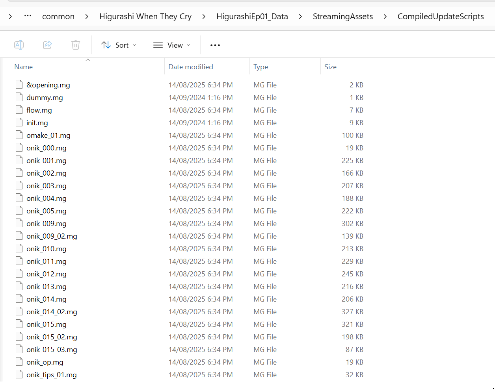
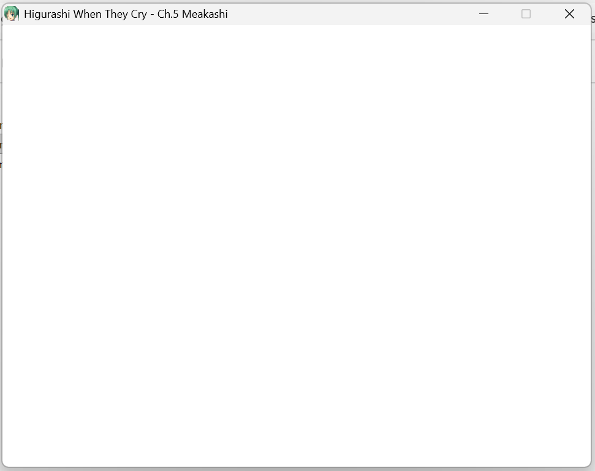

# Other Mods

This page contains Higurashi mods which are not by the 07th-mod team.

## GIN BGM and SE Restoration Patch (WITHOUT 07th-mod)

This patch restores the BGM and SE to the pre-april update versions, to be used on the unmodded game (for example, a freshly installed game from Steam which has been run at least once).

It is a standalone version of the option "GIN's BGM/SE" in the main 07th-mod Higurashi mod (this is where this option originally came from).

For more details, refer to the [BGM/SE FAQ](https://07th-mod.com/wiki/Higurashi/BGM-SE-FAQ/).

### GIN BGM and SE Download Link

Please download the archive from Github: [GIN BGM-SE for Vanilla Higurashi.7z](https://github.com/07th-mod/patch-releases/releases/download/other-mods-v1.0/Gin.BGM-SE.for.Vanilla.Higurashi.7z)

### GIN BGM and SE Install Instructions (all platfoms)

These instructions should work on all platforms (Windows, Linux, MacOS), assuming you can replace files in the game folder.

Full Instructions:

1. Install the game (for example Higurashi Ch.1) from Steam/GOG/Mangagamer
    - NOTE: You will need to repeat this process once for each Higurashi Chapter/Higurashi Game!
2. It is suggested you launch the game once, to let Steam or other launcher perform any first-time setup
3. Close the game, and close Steam or the launcher
4. Open the game folder, for example `Higurashi When They Cry`
    - For instructions, choose your OS below:

        === "Windows/Linux"
            * On Steam: open your Steam library, choose the game from the list, right click on it and click on ``Properties``. Switch to the ``LOCAL FILES`` tab and click on ``Browse local files...``)
        === "MacOS"
            * On Steam: open your Steam library, choose the game from the list, right click on it and click on ``Properties``. Switch to the ``LOCAL FILES`` tab and click on ``Browse local files...``)
            * If you just see an icon called ``HigurashiEpXX`` (where ``X`` is the chapter number), you may need to right click it, then click "Show Package Contents" to show the ``Contents`` folder
            * The game folder (called ``Contents``) should contain some folders like ``Resources``, ``MacOS``, ``Plugins``, ``Frameworks``, and others - we will only be modifying the ``Resources`` folder

5. Delete the **contents** of the `HigurashiEp01_Data/StreamingAssets/CompiledUpdateScripts` folder (not the folder itself)
    - For a fresh install, this folder will only contain a `dummy.mg` file
    
6. Inside the game folder, overwrite the `HigurashiEPXX` with the corresponding file in the provided archive.
    - For example, for Chapter 5, the folder is called `HigurashiEP05`. You would overwrite the `HigurashiEP05` in the game folder with the one from the archive.
     
    <video controls>
    <source src="https://07th-mod.com/wiki/Higurashi/img/other-mods/overwriting-data-folder.mp4" type="video/mp4">
    </video>
    - **MacOS and Linux Users**: your `HigurashiEpXX` folder may be located deeper in the game folder than in Windows.
7. Boot the game, noting that on the first launch, **the game will be unresponsive with a white screen for up to a couple minutes**

    !!! warning "Frozen on first launch with white screen (Compiling Scripts)"
        On the first launch, for Chapters 5-8, **the game may appear to freeze with a white screen for up to a couple minutes**, but it is actually just busy compiling scripts (or you should see a message like "Compiling Scripts".

        - If the game skips this, please ensure you have deleted the contents of the`CompiledUpdateScripts` folder, then try restarting the game
        

8. The mod should now be fully installed
    - To uninstall the mod, delete the entire game folder manually, then re-install the game.
    - TODO: Add instructions to verify mod was installed correctly?

### Change History

| Date         | Changes                                                                                      |
|--------------|----------------------------------------------------------------------------------------------|
| 2025-10-12   | Initial Release created by collecting and re-packaging GIN's BGM/SE for all chapters.        |

### Detailed changes per each chapter

This section is for record keeping purposes only - you don't need to know this to use this BGM/SE patch.

However, for a detailed look at what changes are required per chapter, click below to show detailed information.

??? info "Click to Expand Detailed Changes per each chapter"

    Also refer to the [BGM/SE FAQ](https://07th-mod.com/wiki/Higurashi/BGM-SE-FAQ/).

    #### Changes made to each chapter

    | Chapter              | BGM and SE changes                         | Game Script Changes        |
    |----------------------|--------------------------------------------|----------------------------|
    | Chapters 1-4         | Replace BGM/SE with Question BGM/SE        | Not Required               |
    | Chapter  5           | Replace BGM/SE with Answer BGM/SE          | Apply Ch.5 Script Update   |
    | Chapter  6           | Replace BGM/SE with Answer BGM/SE          | Apply Ch.6 Script Update   |
    | Chapter  7           | Replace BGM/SE with Answer BGM/SE          | Apply Ch.7 Script Update   |
    | Chapter  8           | Replace BGM/SE with Answer BGM/SE          | Apply Ch.8 Script Update   |
    | Chapter  9           | Replace BGM/SE with Ch.9 BGM/SE            | Not Required               |
    | Chapter  10          | Replace BGM/SE with Ch.10 (Hou+) BGM/SE    | Not Required               |

    #### Why are so many files duplicated?

    To make this mod easier to install, the files are organized per chapter, even if they are duplicated.

    For example, the BGM/SE files for Chapters 1-4 are duplicated, as are the ones for Chapters 5-8.

    The duplicate files do not take up extra space in the .7z due to the compression, so the archive download size is not increased despite the duplicates.