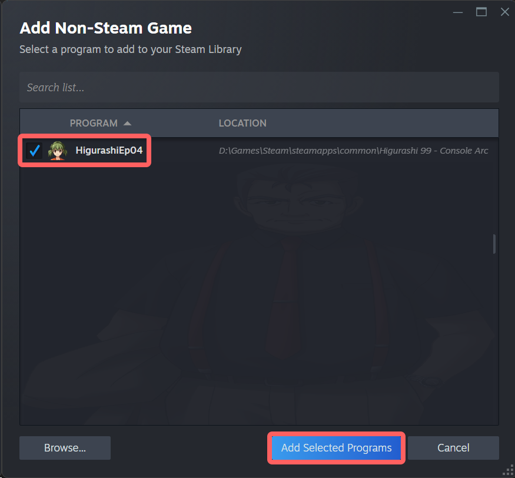

# Console Arcs Steam Library Tutorial - Windows
## Prepare Game Art
* Download and unzip [**this archive**](https://github.com/07th-mod/patch-releases/releases/download/mod-common-v1.0/console-arcs-steamgrid.zip) before getting started.
## Add Console Arcs to Steam
First things first - let's add the Console Arcs to your Steam library.

### Open Steam Library
* Open Steam and select **Library > Home** at the top of the program window.

### Add Non-Steam Game
* At the top of the Steam window, select **Games > Add a Non-Steam Game to My Library...** to open a new window.

* In the **Add Non-Steam Game** window, select **Browse...** at the bottom.

* Navigate to your Console Arcs game executable and select **Open**.
	* The executable will be named **HigurashiEp04.exe** and will have Natsumi's face on it.

* Make sure **HigurashiEp04** is checked in the **Add Non-Steam Game** window, then select **Add Selected Programs** in the bottom-right.

You should now have a new entry for **HigurashiEp04** in your Steam library in the *Uncategorized* section.

If you cannot find it, **use the search bar** at the top of the games list to find it (this will be useful later in the tutorial).

## Change Game Name
Let's rename the game in your library to something nicer than "HigurashiEp04."

### Open Game Properties
* Select **HigurashiEp04** in your Steam library to open it in the main window.

* On the right side of the window, select the gear icon, then **Properties...** to open a new window.

### Rename Game
* In the **Properties > Shortcut** window, use the box at the top to rename the game to **Higurashi When They Cry - Console Arcs**.

 !!! info "Note"
 You can use the name **Higurashi When They Cry Sui** instead if you like - this was the name of the console release on PS3/Vita.
 
 * Close the **Properties** window.

## Add Game Art
Now that the Console Arcs are in your Steam library, let's add their banner and cover art to match the other 07th-Mod titles.

### Add Banner / Logo
* On the left side of your Steam library, select the Console Arcs, if not already selected
* Right-click the empty banner at the top of the Steam window and select **Set Custom Background**.

* Select and open **banner.jpg** in the art archive you downloaded earlier.
* Right-click the (no longer empty) banner again and select **Set Custom Logo**.
* Select and open **logo.png** in the art archive.

Your game banner should now be updated - let's do the covers next.

### Add Covers
!!! warning "Hey, listen!"
	This part is a bit trickier, so make sure to read the instructions carefully.

#### Add Small Cover
* On the left side of your Steam library, select the **Uncategorized** category that contains the Console Arcs.
	* Don't select the game itself, select the category containing it.

You should now see all of your uncategorized games as posters in your library.
* Locate the **Higurashi When They Cry - Console Arcs** game.

* Right-click the Console Arcs game and select **Manage > Set custom artwork**.

* Select and open **cover_small.jpg** in the art archive.

The game cover should now be updated - one more to go.

#### Add Large Cover

* Launch the Console Arcs game once - close it once you reach the main menu.
* In Steam, select **Library > Home** at the top of the window.

In your **Recent Games** shelf, you should see the Console Arcs game with an empty cover.

!!! info "Missing Recent Games Shelf"
	If you don't have a Recent Games shelf, select **+ ADD SHELF** and set **Choose a shelf** to **Recent Games**.

* Right-click the Console Arcs game and select **Manage > Set custom artwork**.
* Select and open **cover_large.jpg** in the art archive.

The game cover should now be updated - and you're all done!

