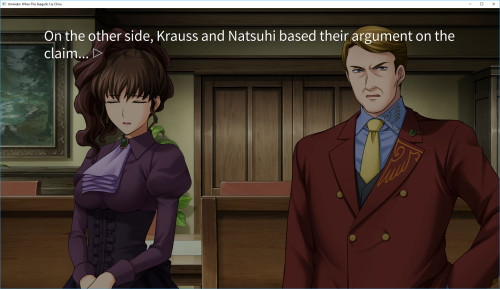
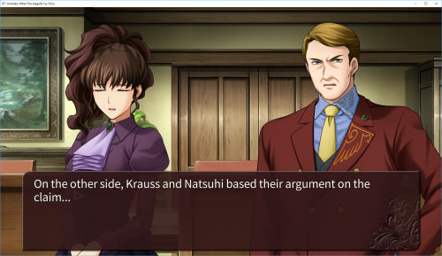

## FAQ / Troubleshooting

See the [Troubleshooting](https://07th-mod.com/wiki/Umineko/Umineko-Part-0-TroubleShooting-and-FAQ) page.

## Regarding Saves and Chapter Progress (Please Read)

Chapter Progress is compatible between the stock and patched game. If you lose your chapter progress, use the 'Unlock' button next to each chapter to unlock it.

Saves Files (that is, save files made within each chapter) are NOT compatible between the stock game and the patched game. Saves between different versions of the patched game may not be compatible - they might skip you forwards / backwards in the script (the `0.u` file). For this reason,  **you should only update your script after completing an episode**. You could also load a very old save to determine if there is any offset in the script, but please be careful not to spoiler yourself by loading an incompatible save. 

## Question Arcs 1080p Beta vs Question Arcs 960p

When we patched the first game, we thought it would be too difficult to change the vertical resolution of the game (which is 960p). This results in a blurry image as the assets have been scaled slightly from their 1080p native resolution.

Later on, one of our members (Forteissimo) has updated most of the game to 1080p, which results in significantly better image quality, but there still may be some graphical bugs relating to the resolution change. We have decided to release this regardless to get feedback on which sections require fixing. Please tell us which sections are not working correctly and we will fix it up. 

## ADV / Textbox Mode (For Chiru ONLY)
ADV Mode (where text appears in a textbox under the screen) is available for the Answer Arcs only:

**Normal Mode**



**ADV Mode**



If you wish to install ADV Mode for the Answer Arcs, complete the normal installation first. When you are finished, scroll to the bottom of this page to install ADV Mode. 

ADV Mode is **not** available for the Question arcs (eps 1-4).

----

## Installer (Windows only)

Currently, on Windows, there are two ways of installing the patch: the automatic installer, and the manual installation (see [Manual Installation](https://07th-mod.com/wiki/Umineko/Umineko-Part-1---Voice-and-Graphics-Patch#manual-installation-windowslinuxmac)). In this section we are going to cover the installer method.

The installer will automatically download and install the following content:

* Full voiceover
* PS3 backgrounds in Full HD
* PS3 sprites and CGs (events) in Full HD
* Updated system menus and tips

Make sure to have at least 15gb of temporary space available, the full installed patch(game included) should be around 10gb. Note that the same installer is used for both the Higurashi and Umineko games (despite the name).
### How to install the patch using the Installer

- Download the latest installer from [the Installer Releases page](https://github.com/07th-mod/Higurashi_Installer_WPF/releases/latest). Launch the program.
- You will be given the choice of Higurashi or Umineko - select the Umineko dropdown
- **Choose whether you are installing the Question or Answer arcs by clicking on the correct icon**
- If the installer says **"Path is valid"** in green text, it has detected your game automatically. If not, you must select it manually:
    - **Set the installation directory to your Steam game directory (also works for MangaGamer's DRM free release).** 
If you are unsure **where** the Steam game is located, open Steam and find it in your Steam library, right-click on it and choose ``Properties``. In the new window that just opened, click on the ``LOCAL FILES`` tab and then on the ``Browse local files...`` button. Copy the address bar in Windows Explorer and paste it in the installer's Windows Explorer window.
- **If the directory is correct, the software will validate the path and let you proceed with the installation.**
- Press 'Install/Update', then 'Confirm' which will start the installation
- **A progress bar and text will show the status of the installation** - bear with it, it may take a long time. When downloading the larger files (graphics and voice files) you can close the program and start it again later, and it should keep your progress (for the Umineko games only, not Higurashi). Preferably, don't close the program while downloading the smaller files.
- **When the install is finished, the temporary install files will be displayed.** You can either back them up, or delete them. **Check the game works correctly before deleting the install files** - Most problems are during installation, it's much faster to reinstall if you have the install files on hand.


Currently only the ***full*** installation method is available. We will include new options (voices only, custom installation) as they are developed.

> **PSA**: as reported, some antivirus softwares might warn you about the installer. **This is a false positive**, and it happens because the installer runs a batch file. The installer code can be freely accessed in our [Resource](https://github.com/07th-mod/resources) repository and is clean of viruses.

### How to update the patch

Currently, the installer will only install the newest version instead of updating it. At this stage, its likely only script updates will happen - that is, you only need to update the 0.utf and not any other files.

Please note that saves aren't necessarily compatible between patches - see the warning at the top of the page.

Sometime in the future, we plan to make a tool that allows you to update only the parts that have newer versions available. Until then, please bear with us.

***
## Installer script (Linux)

Prerequisites: 
- curl (You probably already have this)

```
# Run the following commands in a terminal.

# For Umineko Question Arcs
curl -o install.sh https://raw.githubusercontent.com/07th-mod/resources/master/umineko-question/install_linux.sh 

# For Umineko Answer Arcs
curl -o install.sh https://raw.githubusercontent.com/07th-mod/resources/master/umineko-answer/install_linux.sh 

chmod +x install.sh

# The script will attempt to find the game directory (default steam directory), if it fails you can specify it with ./install.sh path/to/game
./install.sh
```
## Installer script (Mac)
**This an __advanced installation method__. Don't try this unless you know what you're doing**.

Prerequisites: 
- 7-zip command line
- aria2c
- curl 

```
# Run the following commands in a terminal inside the game folder.

# Mac OSX:
brew install p7zip
brew install aria2

# For Umineko Question Arcs:
curl -O https://raw.githubusercontent.com/07th-mod/resources/master/umineko-question/install.sh

# For Umineko Answer Arcs:
curl -O https://raw.githubusercontent.com/07th-mod/resources/master/umineko-answer/install.sh

chmod 755 ./install.sh

./install.sh

```

> The installer script is secure and open-source for anyone to see. Check the code [here for Umineko Question Arcs](https://github.com/07th-mod/resources/blob/master/umineko-question/install.sh) and [here for Umineko Answer Arcs](https://github.com/07th-mod/resources/blob/master/umineko-answer/install.sh).

***

## Manual installation (Windows/Linux/Mac)

Manual installation is not recommended on Windows unless you have problems with the automatic installer. 

If you are on Linux or Mac, you can use the installer scripts above (the Linux installer script should be OK, but we haven't had any reports about the Mac installer script). 

Follow the table below to download all the pieces to install the patch:

> **Don't skip any links!** We can only guarantee the patch will work if you download all the parts of the chapter you want to play.

<table>
<thead>
<tr class="header">
<th>Question Arcs</th>
<th>Script</th>
<th>Voices</th>
<th>Graphics</th>
<th>Executable</th>
<th>Updates</th>
</tr>
</thead>
<tbody>
<tr class="odd">
<td>Question Arcs (Ch.1~4)</td>
<td><a href="http://07th-mod.com/download.php?repository=umineko-question&file=master/InDevelopment/ManualUpdates/0.utf">Download 0.u</a></td>
<td><a href="https://07th-mod.com/Beato/Umineko-Voices.7z">Download</a></td>
<td><a href="https://07th-mod.com/Beato/Umineko-Graphics.zip.001">Part 1</a> <br> <a href="https://07th-mod.com/Beato/Umineko-Graphics.zip.002">Part 2</a> <br> <a href="https://07th-mod.com/Beato/Umineko-Graphics.zip.003">Part 3</a></td>
<td><a href="https://07th-mod.com/Beato/Umineko1to4.exe">Windows</a> <br> <a href="https://07th-mod.com/Beato/0utf_umineko1to4.app.zip">Mac</a> <br> <a href="https://07th-mod.com/Beato/Umineko1to4">Linux</a></td>
<td><a href="https://07th-mod.com/Beato/Umineko-Update-v5_2018_07_15.zip">Update v5 (2018-07-15)</a></td>
</tr>
<tr class="even">
<td>Question Arcs 1080p <strong>Beta</strong></td>
<td><a href="http://07th-mod.com/download.php?repository=umineko-question&file=1080p/InDevelopment/ManualUpdates/0.utf">Download 0.u</a></td>
<td><a href="https://07th-mod.com/Beato/Umineko-Voices.7z">Download</a></td>
<td><a href="https://07th-mod.com/Beato/1080p/Umineko-Graphics-1080p.7z">1080p Graphics</a></td>
<td><a href="https://07th-mod.com/Beato/1080p/Umineko1to4.exe">Windows</a> <br> <a href="https://07th-mod.com/Beato/1080p/0utf_umineko1to4_1080p.zip">Mac</a> <br> <a href="https://07th-mod.com/Beato/1080p/Umineko1to4">Linux</a></td>
<td>Choose <strong>one</strong>
    <br> <a href="https://07th-mod.com/Beato/1080p/Umineko-Update-1080p-v2_2018_12_15_WINDOWS.7z">1080p Update WINDOWS</a>
    <br> <a href="https://07th-mod.com/Beato/1080p/Umineko-Update-1080p-v2_2018_12_15_MAC_LINUX.7z">1080p Update LINUX/MAC</a>
</td>
</tr>
</tbody>
</table>


<table>
<thead>
<tr class="header">
<th>Answer Arcs</th>
<th>Script</th>
<th>Voices</th>
<th>Graphics</th>
<th>Executable</th>
<th>Updates</th>
</tr>
</thead>
<tbody>
<tr class="odd">
<td>Answer Arcs (Ch.5~8)</td>
<td><a href="http://07th-mod.com/download.php?repository=umineko-answer&file=master/0.utf">Download 0.u</td>
<td><a href="https://07th-mod.com/Bern/UminekoChiru-Voices.7z">Download</a></td>
<td><a href="https://07th-mod.com/Bern/UminekoChiru-Graphics.7z">Download</a></td>
<td><a href="https://07th-mod.com/Bern/Umineko5to8.exe">Windows</a> <br> <a href="https://07th-mod.com/Bern/0utf_Umineko5to8.app.zip">Mac</a> <br> <a href="https://07th-mod.com/Bern/Umineko5to8">Linux</a></td>
<td>No Updates</td>
</tr>
<tr class="even">
<td>Answer Arcs ADV Mode Addon</td>
<td>See bottom of page</td>
<td></td>
<td></td>
<td></td>
<td>See bottom of page</td>
</tr>
</tbody>
</table>

### How to install the patch manually 

Common steps are the same for all platforms. The remaining steps are **different** - please be aware of this!

**WARNING**: Make sure you extract any archives directly, without creating a subfolder! If your extraction tool has created an extra subfolder (probably with the same name as the archive), please manually move the files out of the subfolder and into the root game directory, **otherwise the game won't be able to detect the files!**  

#### Common Steps (Windows, Linux, and Mac)

1. Extract the graphics archive (the first part only, it should extract the rest automatically) inside the game folder. The archive is called ``Umineko-Graphics.zip.001`` for the **Question Arcs** , and  ``UminekoChiru-Graphics.7z.001`` for the **Answer Arcs**

2. Extract the voices archive  inside the game folder. The archive is called ``Umineko-Voices.zip`` for the **Question Arcs** and ``UminekoChiru-Voices.7z`` for the **Answer Arcs**

3. Extract the latest update archive, if available, (`Update V[number].zip`) inside the game folder. Overwrite all files if asked.

4. Rename the file ``0.utf`` inside your Umineko folder to ``0_old.utf`` (Backup the original script)

5. **SEE STEPS BELOW SPECIFIC TO YOUR PLATFORM!**

### Windows

6. Put the patched ``0.u`` file inside the game folder.
7. Backup the old .exe. For the **Question Arcs**, rename `Umineko1to4.exe` to `Umineko1to4_old.exe`. For the **Answer Arcs**, rename `Umineko5to8.exe` to `Umineko5to8_old.exe`.
8. Install the new .exe (the one you downloaded from this page). For the **Question arcs**, put the patched `Umineko1to4.exe` in the game folder. For the **Answer Arcs**, put the patched `Umineko5to8.exe` inside the folder.


### Linux
6. Put the patched ``0.u`` file inside the game folder.
7. Backup the old .exe. For the **Question Arcs**, rename `Umineko1to4` to `Umineko1to4_old`. For the **Answer Arcs**, rename `Umineko5to8` to `Umineko5to8_old`.
8. Install the new .exe (the one you downloaded from this page). For the **Question arcs**, put the patched `Umineko1to4` in the game folder. For the **Answer Arcs**, put the patched `Umineko5to8` inside the folder.

### Mac
6. Put the patched ``0.u`` file inside the folder **and** rename it to ``0.utf``
7. Backup the old .exe. This is the file with a character image on it (.app file), but the `.app` part may be hidden. For the **Question Arcs**, rename `Umineko1to4.app` to `Umineko1to4_old.app`. For the **Answer Arcs**, rename `Umineko5to8.app` to `Umineko5to8_old.app`.
8. **IMPORTANT**: MacOSX will try to prevent you from extracting the new, patched `.app` into the game folder! To get around this, you must extract it **outside the game folder** (preferably to your desktop or another personal folder). After you have extracted the .app file, you can then copy it to the root of the game folder (where the old one used to be). Extract  ``Umineko1to4.app.zip`` for the **Question Arcs** and ``Umineko5to8.app.zip`` for the **Answer Arcs**. 

9. If you fail to do step 8 this correctly, you will get this error:

> Missing Game Data
>
>Error (07th mod): The script file '0.utf' is missing from the game directory. https://discord.gg/acSbBtD.

Try step 8 again if you get this error.

----
### All Platforms - Folder Verification

Your folder structure should be something like this after you are finished. If it doesn't, you probably extracted to a subfolder by accident - To fix this, move the files out of the subfolder and into the root directory.

For the Question arcs:

```
BGM
big     //important - graphics
bmp     //important - graphics
en      //important - graphics
fonts
ME
movie
(mysav) //generated when you run the game
SE
sys_se
voice   //important - voices
```

For the Answer arcs:

```
bg      //important - backgrounds
cg      //important - special/cutscene images
BGM
big     //important - graphics
bmp     //important - graphics
en      //important - graphics
fonts
ME
movie
(mysav) //generated when you run the game
SE
sprites //important - character sprites
sys_se
voice   //important - voices
```

### All Platforms - File Verification

Ensure that you have your `0.u` or `0.utf` (depending on your platform), and your patched `Umineko1to4.exe`, `Umineko1to4`, or `Umineko1to4.app` is present in the root of the game folder.

## Updating from older versions

You can check for major updates in the [Getting Started - News](https://07th-mod.com/wiki/Umineko/Umineko-Getting-started#news) section. YOU SHOULD ONLY UPDATE YOUR GAME IN BETWEEN CHAPTERS (eg, once you've completed an episode, and are on the main menu to start an episode). This is because changes to the script may cause your save files to stop working, or jump you forward in the game. Starting a new chapter from the main menu is fine, because it does not 'load' a save.

If you are updating from a very old version of the game, it may be better that you fully re-install the game.

### Using the installer to update

There is *some* support for updating via the installer, but it may not be 100%. Just pretend you are installing the game from scratch, and it should overwrite the old files.

- If you encounter any problems, please try deleting everything in the game directory's `temp` except the Graphics and Voice archives.
- If you still have problems, just delete the entire `temp` folder, which forces the installer to re-download everything.
- If you *still* have problems, it may be better to do a fresh install.

### Manually updating

If you don't want to use the installer, you can (in most cases) update the game by:

- downloading the latest `0.utf` and the latest `Update Zip` in the table above
- extract the `Update Zip` to the game folder 
- overwrite your existing `0.u` (or `0.utf` for mac users) with the `0.utf` file you just downloaded

## ADV Mode (Chiru/Answer arcs ONLY)

<table>
<thead>
<tr class="header">
<th></th>
<th>Script</th>
<th>Updates</th>
</tr>
</thead>
<tbody>
<tr>
<td>ADV Mode Addon</td>
<td><a href="http://07th-mod.com/download.php?repository=umineko-answer&file=adv_mode/0.utf">0.u Script</td>
<td><a href="https://07th-mod.com/Bern/UminekoChiru-ADV_Mode.7z">ADV Assets</a></td>
</tr>
</tbody>
</table>

ADV Mode (textbox at bottom of screen like in the PS3 Game) is for Chiru/Answer arcs ONLY! Do not attempt to install it for the question arcs!

1. Ensure that you have a working release of the full graphics patch of the Chiru Answer Arcs (Scroll back up this page to install it). There is currently no ADV mode for the question arcs.
2. Download the ADV mode **0.u Script** listed above and **replace** the existing 0.u file
3. Download and Unzip the **ADV Assets** archive listed above into the game folder (Check that it creates the following folders: `fonts_adv`, `textbox`, `textbox_black`).
