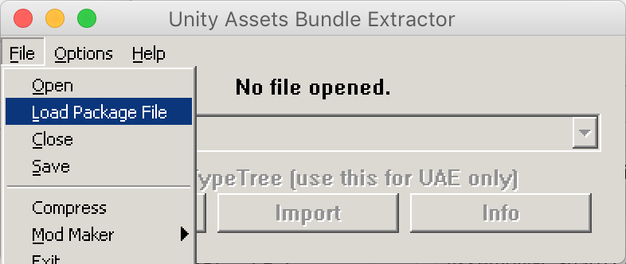

Written by [@tellowkrinkle](https://github.com/tellowkrinkle/).

These [scripts](https://github.com/07th-mod/ui-editing-scripts/tree/master/scripts) can be used to easily update the `sharedassets0.assets` file in Higurashi games. This can save a lot of clicking in UABE and string edits were not even possible without these scripts.

Note: All scripts require Python 3, you may need to replace calls to `pip` and `python` with `pip3` and `python3` if that's what they are on your computer.

There is also another [tool](https://github.com/07th-mod/ui-editing-scripts/blob/master/README.md) written in Rust which can simplify the process even more and you might not even need to read all the details below.

# Installation

!!! info "build.py users"
    If using the `build.py`, dependencies will be installed automatically. Use a virtual environment if you do not want packages installed globally.

Before using these scripts, run the following command to install the dependencies.

```bash
pip install -r requirements.txt
```

## Installation - `decrunch` error

This should no longer occur if you use the above `requirements.txt` to install dependencies, but I've kept the old text below for reference.

UnityPack has dependency on something called `decrunch` which requires Visual C++ Build Tools 14.0 (on Windows) but can still fail to install even if you have them. We're not using the part that needs `decrunch` (it's only used to decompress certain formats of image assets) anyway so if you run into these issues, simply download [this fork](https://github.com/drojf/UnityPack) of unitypack where the dependency is removed and install if with `python setup.py install` from within its folder.

# UnityTextModifier

This script will allow you to edit text files embedded in the asset files of games. This includes most UI elements.

UnityTextModifier.py requires three arguments, the `.assets` file that contains the text you want to edit, a JSON file listing the edits you want to make, and an output directory where the edits will be outputted.  The JSON file should be formatted as an array of objects with the fields `CurrentEnglish`, `CurrentJapanese`, `NewEnglish`, and `NewJapanese`.

There's also an optional `Discriminator` field, which shouldn't be used unless the script finds multiple copies of your string in the file. The script will give a message like `Multiple assets found for ON / ON, candidates are 0: 0x6031370, 1: 0x6038090 ...`, then you can add a line like `Discriminator: 0` to a block in your JSON file like the below example.

Here's an example JSON file:

```json
[
	{
		"CurrentEnglish": "Original",
		"CurrentJapanese": "オリジナル",
		"NewEnglish": "PS3",
		"NewJapanese": "PS3"
	},
	{
		"CurrentEnglish": "Updated",
		"CurrentJapanese": "新規",
		"NewEnglish": "MangaGamer",
		"NewJapanese": "MangaGamer"
	},
	{
		"CurrentEnglish": "Watanagashi 12-3",
		"CurrentJapanese": "綿流し編　１２日目３",
		"NewEnglish": "Watanagashi Day 12-3",
		"NewJapanese": "綿流し編　１２日目３"
	},
	{
		"CurrentEnglish": "ON",
		"CurrentJapanese": "全て",
		"NewEnglish": "Вкл",
		"NewJapanese": "全て",
		"Discriminator": 0
	},
	{
		"CurrentEnglish": "ON",
		"CurrentJapanese": "ON",
		"NewEnglish": "Вкл",
		"NewJapanese": "ON",
		"Discriminator": 1
	}
]
```

Run the program with `python UnityTextModifier.py sharedassets0.assets changes.json outputFolder`
The program will then output one ###.dat file per change into the specified output folder, where the ### is the object ID of the file that it should replace in the assets bundle.  These can be used directly with `EMIPGenerator.py` or manually added in using UABE.

# EMIPGenerator

This script will allow you to collect large numbers of asset bundle modifications into one large file that can be applied in one step using UABE.

EMIPGenerator requires three arguments, the `.assets` file that you want to edit, a directory of edits to make, and the name of the output file (should have the extension `.emip` or UABE won't let you load it).

The edit directory will be read as follows:

* Files that start with a number will replace the object with that number in the assets folder.  For example, `2345.dat` will replace object number 2345.  `2345 Some helpful note as to what this file is.dat` will also replace object number 2345.  Files outputted by UnityTextModifier will be named properly to get picked up by this mode.
* Files that don't start with a number but are in the format `name_type.dat` will replace the first item in the bundle that has that name and type (for example, `ConfigHigurashi_Texture2D.dat` will replace the first item named `ConfigHigurashi` that is a `Texture2D`.  Note that due to issues with UnityPack misreading files, the application uses a very messy way of searching files and therefore may not properly work with all file types in this mode.  The first time you try to add a file in this mode, make sure the program doesn't print `Couldn't find object named <name> for <filename>, skipping`, which indicates that the script failed to find an object to replace.  If this happens, manually look up the ID and prepend it to the file.
* Files that end in `.png` will be converted to `Texture2D` assets before they are inserted into the EMIP.
* Any file that does not start with a number or have an underscore in its name will be completely ignored
* Any file that does have an underscore in its name but doesn't match a file in the asset bundle will still be ignored but may cause the program to run slower (due to searching the whole bundle for a matching file)

Run the program with `python EMIPGenerator.py sharedassets0.assets inputFolder output.emip`.  Then, launch UABE and select `File → Load Package File` and select your emip file.  If you get the error `Unable to read the bundle file! (Invalid file or unknown version?)`, this means that you accidentally selected `File → Open` instead of `File → Load Package File`.  Check the box next to the asset file on the following screen and if it doesn't show the full path to the file (starting with `C:` or whatever drive letter it's in), click the button near the bottom to select a base folder that will get the correct path.  Then click `OK`, which will load the main bundle editing interface with all the edits already in.  From here you can immediately select `File → Save` and save the output asset bundle.

### UABE Screenshots

Select `File → Load Package File` and select your `.emip` file

Check the box and add a base folder if needed, then press OK

Save the new bundle


# TMPAssetConverter

This script converts assets outputted by the current version of TextMeshPro into ones that can be read by the version used by the games.  Note that if TextMeshPro updates it may stop working.  

To use this, you will first need to generate a text atlas using TextMeshPro.  Newer versions of Unity will output assets in a different format, so you will need an older one.  `5.5.5` is known to work, while `2018.2` is known to not work.  Due the python library having issues reading the assets outputted by TextMeshPro, you will need to then use UABE to extract the Atlas (Texture2D) and MonoBehaviour files from the asset, using the `Export Raw` button.  If your version of Unity was too new, you'll find out here as UABE will fail to open the asset file.

You'll also need the MonoBehaviour file that you're trying to replace extracted from the game's asset bundle. The MonoBehaviour files contain pointers to other files in the assets so you can't reuse a file extracted from one chapter. For example if you want to replace the `msgothic_0` font, use `Export Raw` on the `msgothic_0 SDF` file and save it as `oldMonoBehaviour.dat`:


Then, run `python TMPAssetConverter.py newAtlas.dat newMonoBehaviour.dat oldMonoBehaviour.dat outputFolder` and the converter will create two files in the output folder with the same name as the two input files.  These can be substituted back into the asset bundle.  The atlas file can be left out if you don't need to convert it (if you already have a converted copy)

# Getting character lists for font files

To make sure that the character sets you use have all the characters used by the games, use scripts in the [CharacterInfoExtraction](https://github.com/07th-mod/ui-editing-scripts/tree/master/scripts/CharacterInfoExtraction) subfolder.

More detailed info on each of the scripts will be below, but assuming you compiled all the swift programs there and put them in the working directory, you can get a list of all the characters used in the Japanese script like this: `cat pathToHigurashiDataFolder/StreamingAssets/Update/*.txt | ./HigurashiTextExtractor - j | ./UniqueCharacters - > japaneseScriptCharsUsed.txt`.  Note that you can get all the games at once by using multiple wildcards, for example if you have all the Mac versions in a folder you can do all of them at once with `folder/Higurashi*.app/Contents/Resources/Data/StreamingAssets/Update/*.txt`.  Replace the `j` with `e` to get all the characters used in the English script.
That's all you really need for the Japanese script (I recommend taking the kanji from that file and pasting them over the `msgothic_0_charset_Japanese.txt` in the scripts repo to make your final charset)

For English, you'll need to collect a few more files, since the font behind `msgothic_2` will be used to display the game's menus, including the Japanese ones.  Collect all the text used in strings in asset files using `./AssetBundleStringExtractor pathToHigurashiDataFolder/*.assets | ./UniqueCharacters - > assetBundleCharsUsed.txt`.  Then, clone [the DLL code repository](https://github.com/07th-mod/higurashi-assembly) and cat all the `Assets.Scripts.UI.Tips/TipsData.cs` files along with [the console arcs tips JSON](https://github.com/07th-mod/higurashi-console-arcs/blob/master/tips.json) together and run that through `./UniqueCharacters`.  Finally, you can `cat englishScriptCharsUsed.txt assetBundleCharsUsed.txt tipsCharsUsed.txt | ./UniqueCharacters - > englishCharset.txt`.  Like with the Japanese, copy the kanji out of that and paste it over the kanji in the scripts repo's `msgothic_2_charset_OtherLang.txt`.  This is to preserve the extra characters which were added to make translation into other languages easier.

# Adding Font Support for a New Language (Chapters 1-8 ONLY)

The first thing you'll need is a [copy of Unity 5](https://unity3d.com/get-unity/download/archive) (I used 5.5.5 but I would expect newer versions of Unity 5 to work as well).  Once you have that, create a new project, go to the Asset Store, and search for and download TextMeshPro.

### Preparing the character list

To make the font file, you will need a list of all the characters you want in it.  Annoyingly, some of the Japanese parts of the games still rely on the English font, so you'll need to have those characters in addition to the ones you use for your language's character support.  Download the current list from msgothic_2_charset_OtherLang.txt in [here](https://github.com/07th-mod/ui-editing-scripts/tree/master/scripts/CharacterInfoExtraction), which is the list of characters in the current English font.  If your language's characters are already in that file, you shouldn't need to be doing font file editing at all.  Otherwise, modify the text file to replace all the accented roman characters before the `←↑→↓` with all the characters you want in your font.  Don't remove the characters after that point, because they're required to properly display some things in Japanese mode.  Once you've done that, drag the new txt file into the Unity project you made.

### Preparing the font file

Since you'll need support for the Japanese characters in addition to your own language, you'll need to add them to your font file.  If your font file already has Japanese support (which may be the case for some Chinese or Korean fonts), you can skip this step.  Otherwise, download [FontForge](https://fontforge.github.io) and one of the TTF fonts [here](https://github.com/07th-mod/ui-editing-scripts/tree/master/assets/fonts).  Open both the target font and the one you just downloaded using FontForge.  Navigate to `Element → Font Info` with both fonts, go to the `General` tab, and adjust the Em Size of one of the fonts to match the other (if you don't do this, one of the fonts will be way too small or big).  Then, select `Element → Merge Fonts...` in the window for the target font to copy all missing glyphs from the Japanese font over.
In addition, some fonts (like our current English font) use really thin lines for the ☆ character, which Higurashi uses a lot.  Thin lines don't do very well with the font rendering system the game uses, which makes the character look really bad.  Navigate to the entry for ☆, which you can do easily by selecting `View → Goto` and typing `uni2606`, and check if your font uses really thin lines.  If it does, go to the Japanese font, go to the same spot, and copy and paste its ★ and ☆ over yours.
Finally, export the new font to a ttf with `File → Generate Fonts...` and drag the font file into Unity.

### Generating the SDF font

In your Unity project, choose `Window → TextMeshPro → Font Asset Creator`. Select your font as the font source, which should be there if you dragged it into your Unity project.  For the font size, choose Custom Size.  The current fonts use 26pt, but you can choose whatever you like.  Bigger font sizes use more space but look nicer.  Change Font Padding to 6 pt.  If your characters almost fit in the atlas but not quite, you can change the packing method from Fast to Optimal to pack a few more characters in.

For the Atlas Resolution, larger numbers take up more space but allow more or larger characters.  The current Japanese font contains about 3000 26pt Japanese characters and fits in 2048x2048, taking up 4MB.  For Character Set, choose Characters from file and choose the txt file you added earlier.  Leave Font Style at Normal/2 and change Font Render Mode to Distance Field 32 (Note: This is the slowest and highest quality.  If you're still trying to figure out what font/atlas sizes you need, I recommend first choosing Hinted Smooth, which will slightly underestimate the size of the characters but be super fast, then use Distance Field 16 which will get all the character sizes right while still being faster than Distance Field 32, before finally choosing Distance Field 32 for the one you save).

Next, click Generate Font Atlas.  This will take a while for large atlases.  When it's done, it will say in the box if it was unable to fit any characters.  If the resulting atlas is completely full, this is probably because those characters didn't fit, in which case you should adjust your atlas size or font size.  Otherwise, this is because TextMeshPro failed to find those characters in your font.  If it's just some newline characters or spaces this is fine, just look through them to make sure it didn't miss any characters that you think you need.

Once you've saved the font, use the Unity inspector to change its Line Height to be equal to its Point Size.  This is what MS Gothic uses, and a lot of the game's character spacing expects this to be the case.

From here, follow the directions above for TMPAssetConverter to add your font to the game.

# Adding Font Support for a New Language (Higurashi Rei onwards ONLY)

For Rei, the method used for Chapters 1-8 doesn't work. For now, we have the following process.

Please keep in mind the instructions are rough around the edges - please let us know if they don't make sense or need updating!

Also, these instructions roughly [follow this guide in Korean](https://snowyegret.tistory.com/m/21) (thanks to 이칠공), which you [can translate](https://discord.com/channels/384426173821616128/750313515482480699/1013705389205897236).

## Creating the font

1. Install the version of Unity matching the game (roughly). For example, Rei is currently either verison `2019.4.36f1` or version `2019.4.40f1`, so we install version 2019.4.36 (generally the font generated on 2019.4.36 should work for all 2019.4.* versions)
2. Create a new project
3. Add a text object
4. Click Window->TextMeshPro->Font Asset Creator
5. Follow the existing instructions above to make a new font asset (starting from "Preparing the character list" up to and including "Generating the SDF font"), but **DO NOT run TMPAssetConverter**
    * If you're not sure, also refer to the [translated Korean instructions](https://discord.com/channels/384426173821616128/750313515482480699/1013705389205897236)

## Extracting fonts from the built game

### Building the game and opening it in UABE

1. Build/export the project to a known location
2. Install the latest version of UABE [from the UABE repository](https://github.com/SeriousCache/UABE)
3. Open the .sharedassets from the built game using UABE
    * **Open it straight from the game directory! don't copy it somewhere else, as UABE will read some information from the game I think**
4. If a popup appears, select the closest unity version to the version you just exported the dummy game with

### Getting the texture atlas .png

1. Find the SDF atlas file, called `[FONT NAME] SDF Atlas` in the file browser, of type Texture2D (my example was "Binggrae SDF Atlas")
2. Click on that item to select it
3. Click "Plugins" on the right
4. Click "export to .png", press  OK and save it somewhere. Rename it to something you can remember like `FONT_NAME_sdf_atlas.png`

### Getting the monobehavior

1. Repeat the above, but find the file called "MonoBehaviour [FONT NAME] SDF"
2. Click "Export Dump"
3. If a popup appears asking to 'extract extra information', **click Yes**. If another popup appears asking to select a file, **click cancel**. For some reason, even if you click cancel, you'll get the detailed dump.
4. Save the text file with a memorable name like `FONT_NAME_monobehavior_sdf.txt`

## Merging Monobehaviors

1. Repeat "Getting the monobehavior", but this time do it on the game to be modded. In Rei, you're looking for a file called "MonoBehaviour msgothic_2 SDF".
2. Open the unmodded game's `MonoBehaviour msgothic_2 SDF` in one text editor (It's suggested you use Visual Studio Code)
3. Open the exported game's `[FONT NAME] SDF Atlas` (`MonoBehaviour Binggrae_2 SDF` for example) in another text editor window/tab/panel
    * In Visual Studio Code, dragging the second file to the right hand side of the window will open it side-by-side
4. Delete everything below and including the `0 FaceInfo m_FaceInfo` line
5. Copy everything below and including the dummy game's  0 FaceInfo m_FaceInfo line into the game's YAML file
    * The above korean instructions state you may need to manually adjust it, but it seems to work even if you just copy everything in the YAML file after  the 0 FaceInfo m_FaceInfo line

Basically, you just open the two files side by side, then copy everything below `0 FaceInfo m_FaceInfo` into the other file at the corresponding location.

## Extracting files for our scripts

1. Open the game's sharedassets.assets file again in UABE
2. Find and select the SDF atlas called "msgothic_2 SDF Atlas"
3. click plugins
4. click "edit texture"
5. Select the .png file you extracted earlier.
6. Click "Export Raw", and save it as your final atlas .dat (?? hopefully you can do it without saving??)
7. Find and select the "MonoBehaviour msgothic_2 SDF"
8. Click "Import Dump"
9. Choose the merged YAML file you created earlier
10. Click "Export Raw", and save it as your final monobehavior .dat (?? hopefully you can do it without saving??)

## Renaming/moving file so our script ui-editing-scripts can use it

1. Put both the .dat files in the `assets\files-2019.4` folder (or in the future, one matching your unity version)
2. Rename the texture atlas as `msgothic_2 SDF Atlas_Texture2D.dat` to make the script replace by name and type(or use the "replace by Path ID" method?)
3. Rename the monobehavior as `948_MonoBehaviour msgothic_2 SDF.dat` to replace the asset with PathID #948

Once this part is done, the fonts will be automatically included in the output .assets
